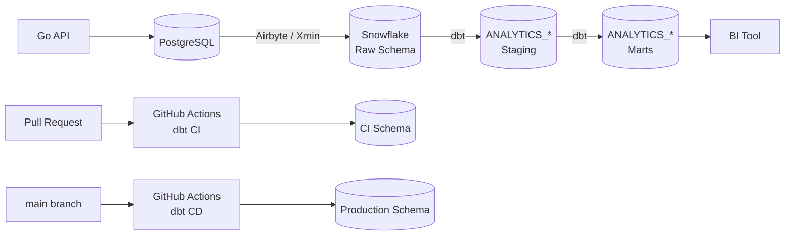

# Airbyte × Snowflake × dbt Data Platform Demo

PostgreSQLの業務データをAirbyteでSnowflakeへ同期し、dbtで分析用モデルへ変換するデータ基盤の個人検証プロジェクトです。

GitHub ActionsとSnowflake Workload Identity Federation（OIDC）を使用し、Pull Request時のCIと、`main`マージ後の本番デプロイまでを自動化しています。

## Architecture



## Goals

このプロジェクトでは、次の一連のデータ基盤構築を実務に近い形で検証します。

- PostgreSQLからSnowflakeへのデータ連携
- Airbyteによる増分同期
- Snowflake上でのRAW / Staging / Marts分離
- dbtによるデータ変換とテスト
- SQLFluffによるSQLの静的解析
- GitHub ActionsによるCI/CD
- GitHub OIDCを利用したパスワードレス認証
- CI環境と本番環境の権限分離
- 将来的なAPI、定期実行、BI連携

## Repository

```text
git@github.com:<github-owner>/<repository-name>.git
```

```text
https://github.com/<github-owner>/<repository-name>
```

## Technology Stack

| Category | Technology |
|---|---|
| Source database | PostgreSQL 16 |
| Data integration | Airbyte Core / abctl |
| Data warehouse | Snowflake |
| Data transformation | dbt Core / dbt-snowflake |
| SQL lint | SQLFluff / dbt templater |
| CI/CD | GitHub Actions |
| Authentication | GitHub OIDC / Snowflake Workload Identity Federation |
| API | Go（予定） |
| BI | 未選定 |

## Project Structure

```text
airbyte-101/
├── .github/
│   └── workflows/
│       ├── dbt_ci.yml
│       └── dbt_cd.yml
├── commerce_analytics/
│   ├── dbt_project.yml
│   ├── models/
│   │   ├── staging/
│   │   │   └── postgres/
│   │   │       ├── _postgres__sources.yml
│   │   │       ├── _postgres__models.yml
│   │   │       ├── stg_postgres__customers.sql
│   │   │       └── stg_postgres__orders.sql
│   │   └── marts/
│   │       ├── _marts__models.yml
│   │       ├── dim_customers.sql
│   │       ├── fct_orders.sql
│   │       └── mart_daily_sales.sql
│   └── tests/
├── requirements-dbt.txt
└── docker-compose.yml
```

## Data Flow

### 1. PostgreSQL

Docker ComposeでPostgreSQL 16を起動します。

| Item | Value |
|---|---|
| Container | `commerce-postgres` |
| Host port | `5433` |
| Container port | `5432` |
| Database | `airbyte_source_db` |
| Airbyte user | `airbyte_reader` |

主要テーブルは次の2つです。

```text
customers
orders
```

### 2. Airbyte

Airbyte Coreを`abctl`でローカルに構築しています。

PostgreSQL Sourceの主な設定は次のとおりです。

```text
Host: host.docker.internal
Port: 5433
Database: airbyte_source_db
User: airbyte_reader
Update method: Xmin
```

Snowflake Destinationは次の構成です。

```text
Database: <snowflake-database>
Schema: <snowflake-raw-schema>
Warehouse: <snowflake-warehouse>
Role: <snowflake-role>
User: <snowflake-user>
```

同期対象テーブルは次のとおりです。

```text
<snowflake-database>.<snowflake-raw-schema>.CUSTOMERS
<snowflake-database>.<snowflake-raw-schema>.ORDERS
```

確認済みの動作です。

- 初回フル同期
- XminによるINSERT検知
- XminによるUPDATE検知
- カラム追加後のSchema Refresh
- Refresh and Remove Records
- 論理削除済み顧客の同期
- キャンセル済み注文の同期

## Delete and Cancel Policy

AirbyteのXmin方式では物理DELETEを検知できないため、業務データは原則として論理削除またはステータス変更で扱います。

### customers

```text
deleted_atによる論理削除
```

### orders

注文は原則として物理削除しません。

```text
status = cancelled
cancelled_at = current_timestamp
updated_at = current_timestamp
```

`orders.status`の許容値は次のとおりです。

```text
pending
paid
shipped
completed
cancelled
```

## Snowflake Layer Design

### RAW

Airbyteが同期したデータを、そのまま保持します。

```text
<snowflake-database>.<snowflake-raw-schema>
```

### Development

```text
Role: <dbt-dev-role>
Warehouse: <dbt-warehouse>
Database: <snowflake-database>
Schema: <dbt-dev-schema>
User: <dbt-dev-user>
```

### CI

Pull Requestごとにdbtモデルを構築し、テストを実行します。

```text
User: <dbt-ci-user>
Role: <dbt-ci-role>
Warehouse: <dbt-warehouse>
Database: <snowflake-database>
Schema: <dbt-ci-schema>
GitHub Environment: ci
```

### Production

`main`へマージされたコードを本番Schemaへデプロイします。

```text
User: <dbt-prod-user>
Role: <dbt-prod-role>
Warehouse: <dbt-warehouse>
Database: <snowflake-database>
Schema: <dbt-prod-schema>
GitHub Environment: prod
```

CI用ロールと本番用ロールは分離し、それぞれの書き込み先Schemaだけを操作できるようにしています。

## dbt Models

### Staging

StagingモデルはViewとして作成します。

```yaml
models:
  commerce_analytics:
    staging:
      +materialized: view
```

モデル：

```text
STG_POSTGRES__CUSTOMERS
STG_POSTGRES__ORDERS
```

顧客モデルの主な列：

```text
CUSTOMER_ID
CUSTOMER_NAME
EMAIL
CREATED_AT
UPDATED_AT
DELETED_AT
IS_DELETED
AIRBYTE_EXTRACTED_AT
```

注文モデルの主な列：

```text
ORDER_ID
CUSTOMER_ID
ORDER_STATUS
TOTAL_AMOUNT
ORDERED_AT
UPDATED_AT
CANCELLED_AT
IS_CANCELLED
AIRBYTE_EXTRACTED_AT
```

### Marts

MartsモデルはTableとして作成します。

```yaml
models:
  commerce_analytics:
    marts:
      +materialized: table
```

モデル：

```text
DIM_CUSTOMERS
FCT_ORDERS
MART_DAILY_SALES
```

`FCT_ORDERS`では、キャンセルされた注文の分析対象金額を`0`に変換します。

```sql
case
  when is_cancelled then 0::number(12, 2)
  else total_amount
end as recognized_order_amount
```

`MART_DAILY_SALES`では日次売上を集計します。

```text
order_date
order_count
valid_order_count
cancelled_order_count
gross_order_amount
recognized_order_amount
```

## dbt Tests

現在、次のテストを実装しています。

- `not_null`
- `unique`
- `accepted_values`
- `relationships`

主な検証内容です。

- `customer_id`がNULLでなく一意であること
- `order_id`がNULLでなく一意であること
- 注文の`customer_id`が顧客テーブルに存在すること
- `order_status`が許容値に含まれること
- Martsでも主キーと参照整合性が保たれること
- `mart_daily_sales`が1日1行であること

確認済みの実行結果です。

```text
5 models
23 data tests
2 sources

PASS=28
WARN=0
ERROR=0
SKIP=0
TOTAL=28
```

## SQLFluff

SQLFluffのdbt templaterを使用しています。

```ini
[sqlfluff]
dialect = snowflake
templater = dbt
encoding = utf-8
max_line_length = 100

[sqlfluff:templater:dbt]
project_dir = .
profiles_dir = ~/.dbt
profile = commerce_analytics

[sqlfluff:indentation]
tab_space_size = 2
implicit_indents = allow

[sqlfluff:rules:capitalisation.keywords]
capitalisation_policy = lower

[sqlfluff:rules:capitalisation.identifiers]
capitalisation_policy = lower
```

ローカルでは次のコマンドを使用します。

```bash
cd commerce_analytics
sqlfluff fix models tests
sqlfluff lint models tests
```

CIではコードを自動修正せず、lintのみ実行します。

```bash
sqlfluff lint models tests --format github-annotation-native
```

## CI/CD

### CI

Pull Requestが作成されると、`dbt CI` Workflowが起動します。

```text
Pull Request
  ↓
SQLFluff lint
  ↓
dbt parse
  ↓
dbt debug
  ↓
dbt build --target ci
  ↓
CI用Schemaへモデル作成・テスト
```

CIのJob名は次のとおりです。

```text
Lint and build dbt
```

GitHub Rulesetで、このJobの成功を`main`へのマージ条件にしています。また、`main`への直接push、force push、branch deletionを制限しています。

### CD

Pull Requestが`main`へマージされると、`dbt CD` Workflowが起動します。

```text
mainへのマージ
  ↓
GitHub OIDC認証
  ↓
dbt parse
  ↓
dbt debug
  ↓
dbt build --target prod
  ↓
本番用Schemaへデプロイ・テスト
```

CI/CDの動作確認は完了しています。

## GitHub Environments

### ci

```text
SNOWFLAKE_ACCOUNT    = <snowflake-account>
SNOWFLAKE_DATABASE   = <snowflake-database>
SNOWFLAKE_ROLE       = <dbt-ci-role>
SNOWFLAKE_SCHEMA     = <dbt-ci-schema>
SNOWFLAKE_USER       = <dbt-ci-user>
SNOWFLAKE_WAREHOUSE  = <dbt-warehouse>
```

### prod

```text
SNOWFLAKE_ACCOUNT    = <snowflake-account>
SNOWFLAKE_DATABASE   = <snowflake-database>
SNOWFLAKE_ROLE       = <dbt-prod-role>
SNOWFLAKE_SCHEMA     = <dbt-prod-schema>
SNOWFLAKE_USER       = <dbt-prod-user>
SNOWFLAKE_WAREHOUSE  = <dbt-warehouse>
```

Snowflakeのパスワードや秘密鍵はGitHub Secretsに登録していません。

## Authentication

GitHub ActionsとSnowflakeの認証には、Workload Identity Federation（OIDC）を使用します。

CIと本番でOIDC Subjectを分離しています。

```text
CI:
repo:<github-owner>@<github-owner-id>/<repository-name>@<repository-id>:environment:ci

Production:
repo:<github-owner>@<github-owner-id>/<repository-name>@<repository-id>:environment:prod
```

これにより、GitHub ActionsからSnowflakeへパスワードレスで接続できます。

## Local Development

### 1. PostgreSQLを起動

```bash
docker compose up -d
```

### 2. Python依存関係をインストール

```bash
python -m pip install --upgrade pip
python -m pip install -r requirements-dbt.txt
python -m pip check
```

### 3. dbt接続確認

ローカルの`~/.dbt/profiles.yml`を設定したうえで実行します。

```bash
cd commerce_analytics
dbt debug
```

### 4. SQL lint

```bash
sqlfluff lint models tests
```

### 5. dbt build

```bash
dbt build
```

## Production Verification

CD完了後は、Snowflakeで次のオブジェクトを確認します。

```sql
show views in schema <snowflake-database>.<dbt-prod-schema>;
show tables in schema <snowflake-database>.<dbt-prod-schema>;
```

想定されるView：

```text
STG_POSTGRES__CUSTOMERS
STG_POSTGRES__ORDERS
```

想定されるTable：

```text
DIM_CUSTOMERS
FCT_ORDERS
MART_DAILY_SALES
```

データ確認には、書き込み用の`<dbt-prod-role>`ではなく、必要に応じて読み取り専用ロールを使用します。

## Current Status

### Completed

- PostgreSQL構築
- Airbyte Core構築
- PostgreSQLからSnowflake RAW層への同期
- XminによるINSERT / UPDATE検知
- dbt Stagingモデル
- dbt Martsモデル
- dbt data tests
- SQLFluff導入
- GitHub Actions CI
- GitHub Rulesetによる`main`保護
- Snowflake OIDC認証
- CI用User / Role / Schema分離
- 本番用User / Role / Schema分離
- GitHub Actions CD
- 本番用Schemaへのデプロイ
- CI/CDの一連の動作確認

### Next Steps

- Go APIの実装
- PostgreSQLへデータを追加する生成CLIの実装
- Airbyteの定期同期
- dbtの定期実行
- dbt source freshnessの導入
- Airbyte成功後にdbtを実行する依存制御
- BIツールとの接続

## Planned API

Go APIでは次のエンドポイントを予定しています。

```text
POST /customers
POST /orders
POST /orders/{id}/cancel
POST /customers/{id}/deactivate
```

データ生成CLIの実行イメージです。

```bash
go run ./cmd/generator \
  --customers 1000 \
  --orders 10000
```

## Planned Scheduling

初期段階では、時刻ベースでの定期実行を検討しています。

```text
毎時00分: Airbyte sync
毎時10分: dbt build
```

将来的には、次のような依存関係ベースの実行を目指します。

```text
Airbyte成功
  ↓
dbt source freshness
  ↓
dbt build
  ↓
dbt data tests
  ↓
BI更新
```

## Notes

このリポジトリは、データエンジニアリングとデータ基盤運用を学ぶための個人検証プロジェクトです。

本番運用を想定する場合は、監視、アラート、コスト管理、データ品質、バックアップ、障害復旧、個人情報管理、Secret管理などを追加で設計する必要があります。
