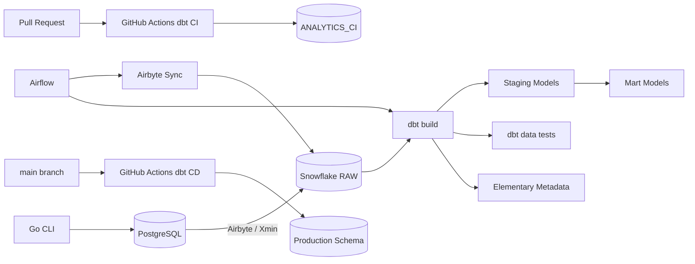
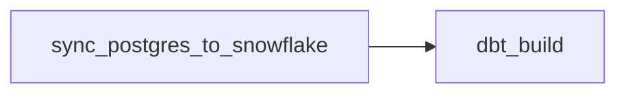

# Airbyte x Snowflake x dbt Data Platform Demo

アプリケーションで発生する業務データを想定し、データ生成、PostgreSQLへの投入、AirbyteによるSnowflake同期、dbtによる分析用モデル作成、データ品質テストまでをE2Eで検証するローカルデータ基盤サンプルです。

GitHub ActionsとSnowflake Workload Identity Federation（OIDC）を使い、Pull Request時のCIと`main`マージ後の本番dbtデプロイも自動化しています。

## What This Project Does

```text
Go CLI
  -> PostgreSQL
  -> Airflow
  -> Airbyte
  -> Snowflake RAW
  -> dbt Staging
  -> dbt Marts
  -> dbt data tests / Elementary
```

各ツールを起動するだけではなく、Go CLIで追加した新しいデータがSnowflake上のMartまで反映されることを確認しています。

実装・確認済みの主な内容です。

- Go CLIによる顧客・注文データ生成
- PostgreSQLへのテストデータ投入
- `batch_id`による二重投入防止
- AirbyteによるPostgreSQLからSnowflake RAW層への同期
- Airbyte XminによるINSERT / UPDATE検知
- AirflowからAirbyte Sync Jobを起動
- Airflowから`dbt build`を実行
- dbt Staging / Martsモデルの作成
- dbt data testsによる品質チェック
- Elementaryによるdbt実行情報・品質メタデータの記録
- SQLFluffによるSQL規約チェック
- GitHub ActionsからSnowflakeへのOIDC認証
- CI / Production用Snowflake User・Role・Schemaの分離
- GitHub Actionsによるdbt CI/CD

## Architecture



Airflow DAG内では、Airbyte Syncが完了してからdbtを実行します。Airbyte Syncが失敗した場合、後続のdbt Taskは実行されません。



## Technology Stack

| Category | Technology | Role |
|---|---|---|
| Data generation | Go | 顧客・注文のテストデータ生成 |
| Source database | PostgreSQL 16 | 元データの保存 |
| Data integration | Airbyte Core / abctl | PostgreSQLからSnowflakeへの同期 |
| Local Airbyte runtime | kind / Kubernetes | ローカルAirbyte環境 |
| Orchestration | Apache Airflow 3.3 | Airbyteとdbtの実行制御 |
| Queue | Redis | Airflow Celery構成のBroker |
| Airflow metadata DB | PostgreSQL | DAG RunやConnectionの保存 |
| Data warehouse | Snowflake | RAW・Staging・Martsの保存 |
| Transformation | dbt Core / dbt-snowflake | SQLモデルの依存関係管理と変換 |
| Data quality | dbt data tests | not_null、unique、relationshipsなど |
| Observability | Elementary | dbt実行・品質メタデータの記録 |
| SQL lint | SQLFluff / dbt templater | SQLの静的解析 |
| CI/CD | GitHub Actions | PR検証と本番dbtデプロイ |
| Authentication | OIDC / Key Pair | CIとローカル環境のSnowflake認証 |

## Project Structure

```text
airbyte_demo_connect_snowflake_public/
├── .github/
│   └── workflows/
│       ├── dbt_ci.yml
│       └── dbt_cd.yml
├── airflow/
│   ├── dags/
│   │   └── commerce_airbyte_sync.py
│   ├── Dockerfile
│   ├── docker-compose.yaml
│   └── requirements.txt
├── cmd/
│   └── generator/
│       └── main.go
├── commerce_analytics/
│   ├── dbt_project.yml
│   ├── packages.yml
│   ├── models/
│   │   ├── staging/
│   │   │   └── postgres/
│   │   └── marts/
│   ├── macros/
│   └── tests/
├── docs/
│   └── data-platform-readme-draft.md
├── postgres/
│   └── init/
├── docker-compose.yml
├── go.mod
├── go.sum
└── requirements-dbt.txt
```

`.secrets/`、`airflow/.env`、dbt生成物、ElementaryレポートはGit管理しません。

## Data Flow

### 1. Generate Data With Go CLI

```bash
export DATABASE_URL='postgres://app_user:<password>@localhost:5433/airbyte_source_db?sslmode=disable'

go run ./cmd/generator \
  --batch-id manual-003 \
  --customers 2 \
  --orders 5 \
  --seed 300
```

主な特徴です。

- `pgx/v5`を使用
- トランザクション内で顧客・注文を登録
- `RETURNING id`で採番された顧客IDを取得
- `generated_batches`で実行済みバッチを管理
- 同じ`batch_id`を再実行しても重複投入しない
- `--seed`指定により再現可能なデータを生成

### 2. Store Source Data In PostgreSQL

Docker ComposeでPostgreSQL 16を起動します。

| Item | Value |
|---|---|
| Container | `commerce-postgres` |
| Host port | `5433` |
| Container port | `5432` |
| Database | `airbyte_source_db` |
| App user | `app_user` |
| Airbyte user | `airbyte_reader` |

主要テーブルです。

```text
customers
orders
generated_batches
```

### 3. Sync PostgreSQL To Snowflake With Airbyte

PostgreSQL Sourceの主な設定です。

```text
Host: host.docker.internal
Port: 5433
Database: airbyte_source_db
User: airbyte_reader
Update method: Xmin
```

Snowflake DestinationはRAW層へ同期します。

```text
Database: <snowflake-database>
Schema: <snowflake-raw-schema>
Warehouse: <snowflake-warehouse>
Role: <snowflake-role>
User: <snowflake-user>
```

同期対象テーブルです。

```text
<snowflake-database>.<snowflake-raw-schema>.CUSTOMERS
<snowflake-database>.<snowflake-raw-schema>.ORDERS
```

確認済みの動作です。

- 初回フル同期
- XminによるINSERT検知
- XminによるUPDATE検知
- カラム追加後のSchema Refresh
- Refresh and Remove Records
- 論理削除済み顧客の同期
- キャンセル済み注文の同期

### 4. Run Airbyte And dbt From Airflow

DAGでは`AirbyteTriggerSyncOperator`でAirbyte Sync Jobを起動し、完了後に`BashOperator`で`dbt build`を実行します。

```python
sync_postgres_to_snowflake = AirbyteTriggerSyncOperator(
    task_id="sync_postgres_to_snowflake",
    airbyte_conn_id="airbyte_default",
    connection_id=AIRBYTE_CONNECTION_ID,
    asynchronous=False,
    wait_seconds=10,
    timeout=1800,
)

dbt_build = BashOperator(
    task_id="dbt_build",
    bash_command="""
        set -euo pipefail

        /opt/airflow/dbt_venv/bin/dbt build \
        --project-dir /opt/airflow/commerce_analytics \
        --profiles-dir /home/airflow/.dbt
    """,
)

sync_postgres_to_snowflake >> dbt_build
```

現在のDAGは手動実行です。

```python
schedule=None
```

## Delete And Cancel Policy

AirbyteのXmin方式では物理DELETEを検知できないため、業務データは原則として論理削除またはステータス変更で扱います。

`customers`は`deleted_at`で論理削除を表します。

`orders`は原則として物理削除せず、キャンセル時は次の値を更新します。

```text
status = cancelled
cancelled_at = current_timestamp
updated_at = current_timestamp
```

`orders.status`の許容値です。

```text
pending
paid
shipped
completed
cancelled
```

## Snowflake Layer Design

RAW層にはAirbyteが同期したデータを保持します。

```text
<snowflake-database>.<snowflake-raw-schema>
```

dbtの実行環境はDevelopment、CI、ProductionでSchemaとRoleを分離します。

| Environment | User | Role | Schema | Authentication |
|---|---|---|---|---|
| Development | `<dbt-dev-user>` | `<dbt-dev-role>` | `<dbt-dev-schema>` | Key Pair |
| CI | `<dbt-ci-user>` | `<dbt-ci-role>` | `<dbt-ci-schema>` | GitHub OIDC |
| Production | `<dbt-prod-user>` | `<dbt-prod-role>` | `<dbt-prod-schema>` | GitHub OIDC |

CI用ロールと本番用ロールは、それぞれの書き込み先Schemaだけを操作できるようにしています。

## dbt Models

StagingモデルはView、MartsモデルはTableとして作成します。

```yaml
models:
  commerce_analytics:
    staging:
      +materialized: view

    marts:
      +materialized: table

  elementary:
    +schema: elementary
```

Stagingモデルです。

```text
STG_POSTGRES__CUSTOMERS
STG_POSTGRES__ORDERS
```

Martsモデルです。

```text
DIM_CUSTOMERS
FCT_ORDERS
MART_DAILY_SALES
```

`FCT_ORDERS`では、キャンセルされた注文の分析対象金額を`0`に変換します。

```sql
case
  when is_cancelled then 0::number(12, 2)
  else total_amount
end as recognized_order_amount
```

`MART_DAILY_SALES`では日次売上を集計します。

```text
order_date
order_count
valid_order_count
cancelled_order_count
gross_order_amount
recognized_order_amount
```

## dbt Tests And Elementary

実装済みの主なテストです。

- `not_null`
- `unique`
- `accepted_values`
- `relationships`
- 金額が負数でないこと
- 日次集計値が負数でないこと

主な検証内容です。

- `customer_id`がNULLでなく一意であること
- `order_id`がNULLでなく一意であること
- 注文の`customer_id`が顧客テーブルに存在すること
- `order_status`が許容値に含まれること
- Martsでも主キーと参照整合性が保たれること
- `mart_daily_sales`が1日1行であること

Elementaryはdbt packageとして導入しています。

```yaml
packages:
  - package: elementary-data/elementary
    version: 0.25.1
```

dbtの実行結果、テスト結果、スキーマ情報、異常検知用メタデータなどをSnowflakeへ保存します。

## SQLFluff

SQLFluffはdbt templaterを使います。

```ini
[sqlfluff]
dialect = snowflake
templater = dbt
encoding = utf-8
max_line_length = 100

[sqlfluff:templater:dbt]
project_dir = .
profiles_dir = ~/.dbt
profile = commerce_analytics
```

ローカルでは次のコマンドを使用します。

```bash
cd commerce_analytics
sqlfluff fix models tests
sqlfluff lint models tests
```

CIではコードを自動修正せず、lintのみ実行します。

```bash
sqlfluff lint models tests --format github-annotation-native
```

dbt templaterでprojectをコンパイルするため、SQLFluffのローカル実行にもdbtの認証設定が必要です。

## Local Setup

### 1. Start PostgreSQL

```bash
docker compose up -d
```

### 2. Install dbt Dependencies

```bash
python -m pip install --upgrade pip
python -m pip install -r requirements-dbt.txt
python -m pip check
```

### 3. Configure dbt Profile

ローカルの`~/.dbt/profiles.yml`を設定します。Snowflake Key Pair認証では次の環境変数を使用します。

```text
DBT_SNOWFLAKE_PRIVATE_KEY_PATH
DBT_ENV_SECRET_SNOWFLAKE_KEY_PASSPHRASE
```

ホストとAirflow Workerでは秘密鍵パスが異なります。

```text
Host:
<repository>/.secrets/dbt/rsa_key.p8

Airflow Worker:
/opt/airflow/secrets/dbt/rsa_key.p8
```

### 4. Validate dbt

```bash
cd commerce_analytics
dbt deps
dbt debug
dbt build
```

## Airflow Setup

### Start Port Forwarding For Airbyte

現在のローカル構成では、AirflowコンテナからAirbyte APIへ接続するためにポートフォワードが必要です。

```bash
kubectl -n ingress-nginx \
  port-forward service/ingress-nginx-controller 18080:8000
```

Airflowから利用するURLです。

```text
http://host.docker.internal:18080/api/public/v1/
```

### Start Airflow

```bash
docker compose \
  --env-file airflow/.env \
  -f airflow/docker-compose.yaml \
  -p airflow-lab \
  up -d
```

主なサービスです。

```text
airflow-apiserver
airflow-scheduler
airflow-worker
airflow-triggerer
airflow-dag-processor
postgres
redis
```

dbtはAirflowイメージ内の専用venvにインストールしています。

```text
/opt/airflow/dbt_venv/bin/dbt
/opt/airflow/dbt_venv/bin/sqlfluff
```

### Check DAG Import

```bash
docker compose \
  --env-file airflow/.env \
  -f airflow/docker-compose.yaml \
  -p airflow-lab \
  exec airflow-apiserver \
  airflow dags list-import-errors
```

正常時です。

```text
No data found
```

### Check Airbyte Connection

```bash
docker compose \
  --env-file airflow/.env \
  -f airflow/docker-compose.yaml \
  -p airflow-lab \
  exec airflow-apiserver \
  airflow connections test airbyte_default
```

正常時です。

```text
Connection success!
```

`airflow connections get`は復号済みSecretを表示する場合があるため、出力を共有しないでください。

### Run DAG

Airflow UIから`commerce_airbyte_sync`を手動実行します。

```text
sync_postgres_to_snowflake
  -> dbt_build
```

## Snowflake Verification

```sql
select count(*)
from AIRBYTE_LAB_DB.ANALYTICS_DEV.DIM_CUSTOMERS;

select count(*)
from AIRBYTE_LAB_DB.ANALYTICS_DEV.FCT_ORDERS;

select *
from AIRBYTE_LAB_DB.ANALYTICS_DEV.MART_DAILY_SALES
order by order_date desc;
```

確認観点です。

- `DIM_CUSTOMERS`が追加顧客数分増えている
- `FCT_ORDERS`が追加注文数分増えている
- `MART_DAILY_SALES`の該当日の件数・金額が更新されている

日次Martは日付単位の集計なので、新規データを追加しても必ずしも行数が増えるわけではありません。

## CI/CD

### CI

Pull Requestが作成されると、`dbt CI` Workflowが起動します。

```text
Pull Request
  -> SQLFluff lint
  -> dbt parse
  -> dbt debug
  -> dbt build --target ci
  -> CI用Schemaへモデル作成・テスト
```

CIのJob名です。

```text
Lint and build dbt
```

GitHub Rulesetで、このJobの成功を`main`へのマージ条件にしています。また、`main`への直接push、force push、branch deletionを制限しています。

### CD

`main`へpushされると、`dbt CD` Workflowが起動します。

```text
mainへのpush
  -> GitHub OIDC認証
  -> dbt deps
  -> dbt parse
  -> dbt debug
  -> dbt build --target prod
  -> 本番用Schemaへデプロイ・テスト
```

CDのJob名です。

```text
Deploy dbt to production
```

CI/CDの動作確認は完了しています。

## GitHub Environments

### ci

```text
SNOWFLAKE_ACCOUNT    = <snowflake-account>
SNOWFLAKE_DATABASE   = <snowflake-database>
SNOWFLAKE_ROLE       = <dbt-ci-role>
SNOWFLAKE_SCHEMA     = <dbt-ci-schema>
SNOWFLAKE_USER       = <dbt-ci-user>
SNOWFLAKE_WAREHOUSE  = <dbt-warehouse>
```

### prod

```text
SNOWFLAKE_ACCOUNT    = <snowflake-account>
SNOWFLAKE_DATABASE   = <snowflake-database>
SNOWFLAKE_ROLE       = <dbt-prod-role>
SNOWFLAKE_SCHEMA     = <dbt-prod-schema>
SNOWFLAKE_USER       = <dbt-prod-user>
SNOWFLAKE_WAREHOUSE  = <dbt-warehouse>
```

Snowflakeのパスワードや秘密鍵はGitHub Secretsに登録していません。

## Authentication

GitHub ActionsとSnowflakeの認証には、Workload Identity Federation（OIDC）を使用します。

CIとProductionでOIDC Subjectを分離しています。

```text
CI:
repo:<github-owner>@<github-owner-id>/<repository-name>@<repository-id>:environment:ci

Production:
repo:<github-owner>@<github-owner-id>/<repository-name>@<repository-id>:environment:prod
```

これにより、GitHub ActionsからSnowflakeへパスワードレスで接続できます。

ローカルとAirflowではSnowflake Key Pair認証を使用します。秘密鍵とパスフレーズはGit管理しません。

## Secret Management

Gitへ登録しないものです。

- Airbyte Client Secret
- Snowflake秘密鍵
- 秘密鍵のパスフレーズ
- Airflow Fernet Key
- `airflow/.env`
- `.secrets/`

確認コマンドです。

```bash
git check-ignore -v airflow/.env
git check-ignore -v .secrets/dbt/rsa_key.p8
git ls-files airflow/.env .secrets
```

誤って追跡している場合は、履歴や共有範囲を確認したうえでインデックスから外します。

```bash
git rm --cached airflow/.env
git rm --cached -r .secrets
```

## Troubleshooting Notes

### `airbyte_default`が見つからない

```text
The conn_id `airbyte_default` isn't defined
```

Airbyte APIへ接続する前に、Airflow Metadata DBからConnectionを取得できず失敗していました。Airflow Connection IDとして`airbyte_default`を登録します。

### Fernet Keyが不正

```text
Fernet key must be 32 url-safe base64-encoded bytes
```

正しい44文字のFernet Keyを設定し、全Airflowサービスで同じキーを使います。一度使用したキーを不用意に変更すると、旧キーで暗号化したConnectionを復号できなくなります。

### dbt秘密鍵パスがホスト側パスだった

Airflow Worker内でMac側の絶対パスを参照していたため、秘密鍵を読み込めませんでした。コンテナ内パス`/opt/airflow/secrets/dbt/rsa_key.p8`へ変更して解消しました。

### SQLFluff実行時にdbt接続エラー

SQLFluffはdbt templaterでprojectをコンパイルするため、Snowflake接続用の環境変数や秘密鍵が必要です。

```text
DBT_SNOWFLAKE_PRIVATE_KEY_PATH
DBT_ENV_SECRET_SNOWFLAKE_KEY_PASSPHRASE
```

### RequestsDependencyWarning

Snowflake Connector関連の依存警告が表示される場合があります。現在はSnowflake接続、dbt build、data testsまで成功しているため、処理を止めるエラーではありません。

## Current Limitations

- Airflow DAGは手動実行
- Airbyteへの接続にポートフォワードが必要
- Airbyte Connection IDはDAG内定数
- 通知機能は未実装
- BIツールは未接続
- SQLFluffのローカル実行にはdbt認証設定が必要
- Snowflake Connectorの依存警告が残っている

## Next Steps

優先度高:

- Airflow DAGの定期実行
- Airflow失敗通知
- SQLFluff違反の完全解消
- Airbyte Connection IDの環境変数化
- Secretローテーション手順の整理

優先度中:

- dbt source freshness
- Elementaryアラート
- dbt snapshot
- incremental model
- BI接続
- Snowflakeコスト監視

## Current Status

完了済みです。

- [x] PostgreSQLのソーステーブル作成
- [x] Go CLIによるデータ生成
- [x] `batch_id`による冪等性
- [x] Airbyte Source / Destination設定
- [x] PostgreSQLからSnowflake RAWへの同期
- [x] Airflow Docker Compose環境
- [x] AirflowからAirbyte Sync起動
- [x] Airflow Workerへのdbt導入
- [x] Airflowからdbt build実行
- [x] dbt Staging / Martモデル
- [x] dbt data tests
- [x] Elementary導入
- [x] Go CLIからSnowflake MartまでのE2E確認
- [x] GitHub Actions OIDC
- [x] CI用Snowflakeユーザー・ロール・スキーマ
- [x] 本番用Snowflakeユーザー・ロール・スキーマ
- [x] SQLFluff CI
- [x] dbt CI/CD

未対応または今後の拡張候補です。

- [ ] SQLFluff違反の完全解消
- [ ] Airflow定期実行
- [ ] 失敗通知
- [ ] BI接続
- [ ] コスト監視
